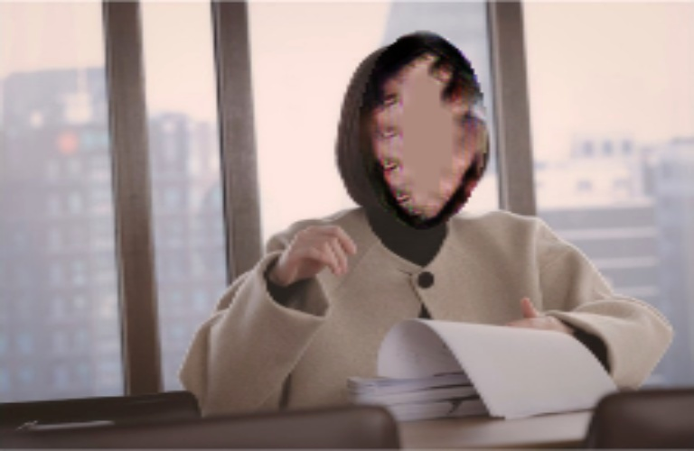

# Face-Blur

Official Pytorch implementation of Face-Blur Model | [Paper](https://drive.google.com/file/d/14Krwy55_S4TZ3VeRlEemMd-R0gWAk0ml/view?usp=sharing)

**[Jaechan Jo](mailto:jjc123a@naver.com), Jongseok Lee.**

Multi Media System Lab, Sogang AI Research.

## Sample Results
### Overview
De-identify the face while preserving image feature using feature inversion, cycleGAN

- Feature Inversion

  - 

- CycleGAN
  - residual block

    


  - no residual block

    
  

## Model

### 0. Weight

- [CycleGAN-residual block: G_100.pth](https://drive.google.com/file/d/1SDpJphwBbtVAnOwDXUOJBqBIMTDuGK9b/view?usp=sharing)
- [CycleGAN-no residual block: G_100_no.pth](https://drive.google.com/file/d/1nWka8iwygB4uRXHty2x9JUSeCsyRlf9R/view?usp=sharing)

> Source from [GitHub - deepcam-cn/yolov5-face: YOLO5Face: Why Reinventing a Face Detector (https://arxiv.org/abs/2105.12931)](https://github.com/deepcam-cn/yolov5-face)
> - [Yolov5 face-large: face_l.pt](https://drive.google.com/file/d/1uWR7O4ka6dJitWLc9zR3kwFJhpsmCeqj/view?usp=sharing)
> - [Yolov5 face-medium: face_m.pt](https://drive.google.com/file/d/1blTdj5GXR8T5RoWGnNDXdx5ljPEag3Bh/view?usp=sharing)


### 1. Feature Inversion

```Yolov5(face-detector) > SqueezeNet(CNN-feature inversion)```

### Hyper-parameter description

> - *Adjusted_params*
>   - ```image```**(single)**: image to make blur : content_image. (입력 이미지)
>   - ```distort_weight```**(1~5)**: As the weight increases, the face becomes increasingly distorted. (왜곡 가중치, 얼굴 왜곡 정도)
>   - ```fade_weight```**(1~5)**: As the weight increases, the face gradually fades. (희석 가중치, 얼굴 희미한 정도)
>   - ```dataset_folder```**(default)**: original content face images directory. (입력 이미지 폴더 경로)


> - *Additional_params*
>   - ```save_folder```: directory to save blur results. (결과 이미지 저장 폴더 경로)
>   - ```weights```: (face_detector)_model.pt path(s). (얼굴 탐지 모델 가중치 파일 경로)
>   - ```img_size```: (face_detector)_inference size (pixels). (얼굴 탐지 모델 입력 이미지 크기)
>   - ```conf_thres```: (face_detector)_object confidence threshold. (얼굴 탐지 확신 정도 기준 값)
>   - ```iou_thres```:  (face_detector)_IOU threshold for NMS. (얼굴 탐지 겹친 영역 정도 기준 값)
>   - ```iteration```: how many iterations to feature-inversion. (학습 횟수)
>   - ```device```: cuda device, i.e. 0 or 0,1,2,3 or cpu. (GPU 설정)
>   - ```eval```: show various evaluation tools : blur_image, inference_time, cos_similarity, SSIM. (평가 지표 출력 여부)
>   - ```circle```: blur face in shape of circle or rectangle, if False, its rectangle. (비식별화 모양, 타원형 | 직사각형)

### 2. CycleGAN

```Yolov5(face-detector) > CycleGAN(residual block | no residual block)```

### Hyper-parameter description

> - *Adjusted_params*
>   - ```img```: image to make blur : content_image


> - *Additional_params*
>   - ```save_path```: directory to save blur images. (결과 이미지 저장 폴더 경로)
>   - ```G_model_path```: Generator_model.pt path(s). (생성 모델 가중치 파일 경로)
>   - ```Y_model_path```: Yolov5(face_detector)_model.pt path(s). (얼굴 탐지 모델 가중치 파일 경로)
>   - ```transform```: To do transform. (이미지 사이즈, 정규화, 텐서 변환 여부)
>   - ```img_size```: (face_detector) inference size (pixels). (얼굴 탐지 모델 입력 이미지 크기)
>   - ```conf_thres```: (face_detector) object confidence threshold. (얼굴 탐지 확신 정도 기준 값)
>   - ```iou_thres```: (face_detector) IOU threshold for NMS. (얼굴 탐지 겹친 영역 정도 기준 값)
>   - ```device```: cuda device, i.e. 0 or 0,1,2,3 or cpu. (GPU 설정)
>   - ```residual_block```: whether the generator has residual block or not. (잔차 층 추가 여부)
>   - ```circle```: blur face in shape of circle or rectangle, if False, its rectangle. (비식별화 모양, 타원형 | 직사각형)


## Setup

### Docker compose

```docker run --gpus all -itd -e LC_ALL=C.UTF-8 --name face_blur -v"[gpu server dir]":/workspace/ -p 20000:8888 -p 20001:8097 -p 20002:22 nvcr.io/nvidia/pytorch:21.07-py3 /bin/bash```

  > - **docker name(이름 정의)**: e.g.) face_blur
  > - **gpu server dir(도커 가상환경에 연결할 GPU 서버 폴더 경로)**: git clone dir(깃클론한 폴더 경로를 넣어주세요) e.g.) /media/mmlab/hdd3/Face-Blur-Preserving-Feature 
  > - **mounted docker dir(연결된 도커 폴더 경로)**: e.g.) /workspace/
  > - **port forwading(포트 설정)**: e.g.) 20000:8888(jupyter), 20001:8097(visdom), 20002:22(ssh)
  > - **docker image(도커 이미지)**: e.g.) nvcr.io/nvidia/pytorch:21.07-py3


## Inference code


### Multi images with Multi-faces

1. face_blur_feature_inversion.py
  
  ```
  python face_blur_feature_inversion.py \
  --distort_weight [int: 1~5] \
  --fade_weight [int: 1~5] \
  --dataset_folder [str: image path] \
  --save_folder [None | str: save path] \
  --eval [boolean: True | False] \
  --circle [boolean: True | False]
  ```

2. face_blur_feature_inversion_func.py

  ```
  def face_blur_multi(distort_weight=[int: 1-5], fade_weight=[int: 1-5], dataset_folder=[str: image path],
                      save_folder=[None | str: save path], weights=[str: yolov5 weight path], 
                      eval = [boolean: True | False], circle = [boolean: True | False])
  ```


### One images with Multi-faces

3. face_blur_feature_inversion_func_single.py

  ```
  def face_blur_single(image, distort_weight=[int: 1-5], fade_weight=[int: 1-5], save_folder=[None | str: save path],
                       weights=[str: yolov5 weight path], eval = [boolean: True | False], circle = [boolean: True | False])
  ```

4. face_blur_feature_inversion_func_single.ipynb

  > it contains the results of the execution


### One images with One-faces


5. face_blur_GAN_func_single.py

  ```
  def face_blur_GAN_single(img, save_path=[None | str: save path],
                           G_model_path=[str: generator weight path], Y_model_path=[str: yolov5(face_detector) weight path], 
                           residual_block = [boolean: True | False], circle = [boolean: True | False])
  ```
  
