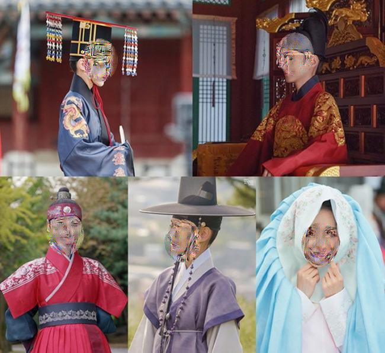

# Face-Blur

Official Pytorch implementation of Face-Blur Model

**[Jaechan Jo](mailto:jjc123a@naver.com), Jongseok Lee.**

Multi Media System Lab, Sogang AI Research.

## Sample Results
### Overview
De-identify the face while preserving image feature using feature inversion, cycleGAN

- Feature Inversion

  - 

- CycleGAN
  - residual block

    


  - no residual block

    


## Model

### 0. Weight

- [CycleGAN-residual block: G_100.pth](https://drive.google.com/file/d/1RdB5e_TQKDuCGqxOqfp5W1PI65xu8UU8/view?usp=sharing)
- [CycleGAN-no residual block: G_100_no.pth](https://drive.google.com/file/d/1fzLMqogb5k8ZMLvYs9yulobNGdVTDBci/view?usp=sharing)

> Source from [GitHub - deepcam-cn/yolov5-face: YOLO5Face: Why Reinventing a Face Detector (https://arxiv.org/abs/2105.12931)](https://github.com/deepcam-cn/yolov5-face)
> - [Yolov5 face-large: face_l.pt](https://drive.google.com/file/d/1G4o3pS1SnyPG35lNvdqhHEMR7bhBTgmH/view?usp=sharing)
> - [Yolov5 face-medium: face_m.pt](https://drive.google.com/file/d/1WSgaSLphrUrb07FPMC9SHDOMk23U1LHH/view?usp=sharing)

### 1. Feature Inversion

```Yolov5(face-detector) > SqueezeNet(CNN-feature inversion)```

### Hyper-parameter description

> - *Adjusted_params*
>   - ```image```**(single)**: image to make blur : content_image
>   - ```distort_weight```**(1~5)**: As the weight increases, the face becomes increasingly distorted.
>   - ```fade_weight```**(1~5)**: As the weight increases, the face gradually fades.
>   - ```dataset_folder```**(multi)**: original content face images directory


> - *Additional_params*
>   - ```save_folder```: type=str, help=directory to save blur results
>   - ```weights```: type=str, default='./weights/face_l.pt', help=(face_detector)_model.pt path(s)
>   - ```img_size```: type=int, default=640, help=(face_detector)_inference size (pixels)
>   - ```conf_thres```: type=float, default=0.5, help=(face_detector)_object confidence threshold
>   - ```iou_thres```:  type=float, default=0.5, help=(face_detector)_IOU threshold for NMS
>   - ```iteration```: type=int, default=400, help=how many iterations to feature-inversion
>   - ```device```: type=str, default='0', help=cuda device, i.e. 0 or 0,1,2,3 or cpu
>   - ```eval```: type=str, default=False, help=show various evaluation tools : blur_image, inference_time, cos_similarity, de-identification value(SSIM)


### 2. CycleGAN

```Yolov5(face-detector) > CycleGAN(residual block | no residual block)```

### Hyper-parameter description

> - *Adjusted_params*
>   - ```img```: image to make blur : content_image


> - *Additional_params*
>   - ```save_path```: directory to save blur images
>   - ```G_model_path```: Generator_model.pt path(s)
>   - ```Y_model_path```: Yolov5(face_detector)_model.pt path(s)
>   - ```transform```: To do transform
>   - ```img_size```: (face_detector) inference size (pixels)
>   - ```conf_thres```: (face_detector) object confidence threshold
>   - ```iou_thres```: (face_detector) IOU threshold for NMS
>   - ```device```: cuda device, i.e. 0 or 0,1,2,3 or cpu


## Inference code

### Multi images with Multi-faces


1. face_blur_feature_inversion.py
  
  ```
  python face_blur_feature_inversion.py \
  --distort_weight [int: 1~5] \
  --fade_weight [int: 1~5] \
  --dataset_folder [str: image path] \
  --save_folder [None | str: save path] \
  --eval [boolean: True | False]
  ```

2. face_blur_feature_inversion_func_ver.py

  ```
  def face_blur_multi(distort_weight=[int: 1-5], fade_weight=[int: 1-5], dataset_folder=[str: image path], \
  save_folder=[None | str: save path], weights=[str: yolov5 weight path], eval = [boolean: True | False])
  ```

### One images with Multi-faces


3. face_blur_feature_inversion_func_single.py

  ```
  def face_blur_single(image, distort_weight=[int: 1-5], fade_weight=[int: 1-5], save_folder=[None | str: save path], \
  weights=[str: yolov5 weight path], eval = [boolean: True | False])
  ```

### One images with One-faces


4. face_blur_GAN_func_single.py

  ```
  def face_blur_GAN_single(img, save_path=[None | str: save path], G_model_path=[str: generator weight path], Y_model_path=[str: yolov5(face_detector) weight path])
  ```
                         
                         
